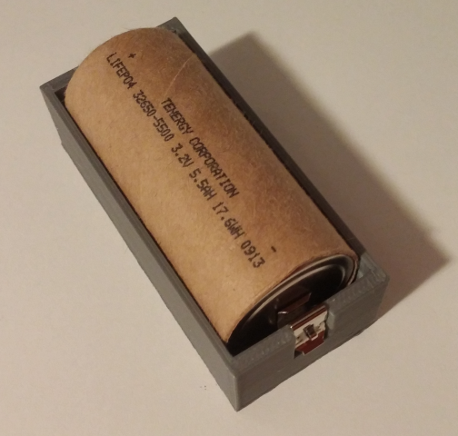
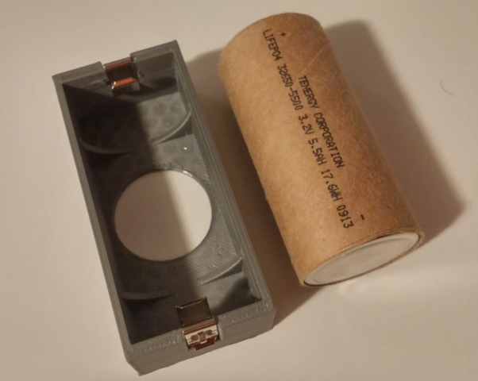

# 3D printable cylindrical battery cell holder

This is a 3d-printable battery cell holder for cylindrical type cells, currently configured for 32650 LiFePo4 cells which I could not find any existing holders for, however should be fine with adjusted parameters for any 18650 cells, or other "standard" size cylindrical cells such as 18650, D, C, A, etc. This holder is designed around the Keystone 209 battery spring clip, available quite inexpensively from many online electronics parts warehouses such as Digikey, Jameco, Mouser, or others.

## Getting Started

The template is written for OpenSCAD, so you'll need that. It's mostly parameterized, so changing it for other batteries should work out easily. I've printed out the initial version and made some additional tweaks.
